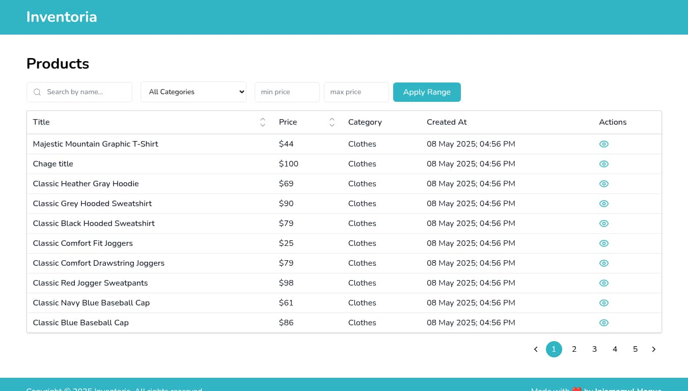

## &nbsp;

<h1 align="center">Product Inventory App</h1>

## Table of Contents

- [Table of Contents](#)
- [About](#about)
- [Prerequisites](#prerequisites)
- [Installing](#installing)
- [Third Party Dependencies](#third-party-dependencies)
- [Files And Directories Tree](#files-and-directories-tree)

## About

**Inventoria** is a simple and efficient product inventory management application built using the latest features of **React 19** and **Next.js 15**.

### Features

- **Product Listing Page** – View a list of all products with pagination, search and filter.
- **Product Details Page** – See detailed information for a selected product.
- **Server-Side API Calls** – All data fetching is handled on the server using Next.js's modern data fetching strategies for better performance and SEO.

### Tech Stack

- **Next.js 15** – Leveraging App Router, Server Components, and other modern features.
- **React 19** – Includes new built-in APIs like `use`, `useFormStatus`, and improved performance through React Compiler and Concurrent Features.
- **Tailwind CSS** – Utility-first CSS framework for rapid UI development.
- **TypeScript** – Ensures type safety and improved developer experience.

## Prerequisites

- [Node : ^18.18.0](https://nodejs.org/en/download/)
- [npm : ^9.6.7](https://nodejs.org/en/download/)
- [Yarn : ^1.22.19](https://classic.yarnpkg.com/en/docs/install)
- [Git](https://git-scm.com/downloads)

## Installing

- Open terminal or command prompt

- Clone the project

  > ```bash
  > git clone https://github.com/meinjam/inventoria-strativ
  > cd inventoria-strativ
  > ```

- Install required libraries for project

  > `npm install`\
  > _or,_ \
  > `yarn`

- Create a .env file in the root of the project and add the following:

  > ```bash
  > BASE_URL="https://api.escuelajs.co/api/v1"
  > ```

- Run the code after installing the libraries

  > `npm run dev`\
  > _or,_ \
  > `yarn dev`

_Note: Now this will run the app in the development mode and Open http://localhost:3000 to view it in the default browser._

- Create build file

  > `npm run build` \
  > _or,_ \
  > `yarn build`

## Third Party Dependencies

- **_clsx >= 2.1.1:_**
  _A utility for conditionally joining classNames together. A lightweight alternative to the `classnames` package._

- **_dayjs >= 1.11.13:_**
  _A lightweight JavaScript date library for parsing, validating, manipulating, and formatting dates._

- **_rc-pagination >= 5.1.0:_**
  _React pagination component inspired by Ant Design._

- **_react-hot-toast >= 2.5.2:_**
  _A lightweight, customizable toast notification library for React._

- **_react-icons >= 5.5.0:_**
  _Popular icon sets (like FontAwesome, Feather, etc.) wrapped as React components._

- **_tailwind-merge >= 3.2.0:_**
  _Utility to intelligently merge Tailwind CSS classes in JS without style conflicts._

- **_use-debounce >= 10.0.4:_**
  _A React hook for debouncing input values or function calls._

### Dev Dependencies

- **_husky >= 9.1.7:_**
  _Git hooks manager, used for setting up pre-commit/pre-push actions._

- **_prettier >= 3.5.3:_**
  _An opinionated code formatter that enforces consistent style._

- **_prettier-plugin-tailwindcss >= 0.6.11:_**
  _Prettier plugin for automatically sorting Tailwind CSS class names._

- **_@tailwindcss/postcss >= 4:_**
  _PostCSS plugin wrapper provided by Tailwind CSS._

- **_tailwindcss >= 4:_**
  _A utility-first CSS framework for building modern UIs._

- **_typescript >= 5:_**
  _A strongly typed programming language that builds on JavaScript._

- **_@types/react, @types/node, @types/react-dom:_**
  _TypeScript definitions for React, Node.js, and ReactDOM._

## Files And Directories Tree

- **_.husky :_**\
  _Husky enhances your commits and more 🐶 woof! Automatically lint your commit messages, code, and run tests upon committing or pushing._
- **_public :_**\
  _Holds all public file._
- **_src :_** \
  _Holds js files which will be mostly edited._
  - **_actions :_** \
    _Holds all server-side actions like get, post requests._
  - **_app :_** \
    _Contains layouts, pages, and route-level logic (App Router)._
  - **_assets :_** \
    _Holds static files like styles and images._
    - **_css :_**\
      _Contains Tailwind and global CSS files._
    - **_img :_** \
      _Holds the required images for pages and components._
  - **_components :_** \
    _Reusable UI components._
  - **_lib :_** \
    _Shared libraries and utility functions._
  - **_types :_** \
    _Type definitions used across the app._
  - **_utils :_** \
    _Helper functions and constants._
- **_.gitignore_**\
  _Git ignored files_
- **_.prettierignore_**\
  _Files ignored by Prettier_
- **_.prettier_**\
  _Prettier configuration_
- **_next-env.d.ts_**\
  _Next.js environment type definitions_
- **_next.config.ts_**\
  _Next.js configuration file_
- **_package-lock.json_**\
  _Project dependencies_
- **_package.json_**\
  _Project dependencies_
- **_postcss.config.mjs_**\
  _PostCSS config for Tailwind_
- **_README.md_**\
  _Project documentation_
- **_tsconfig.json_**\
  _TypeScript configuration_
